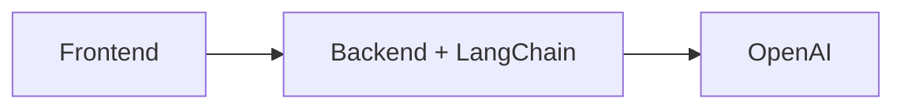
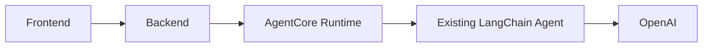
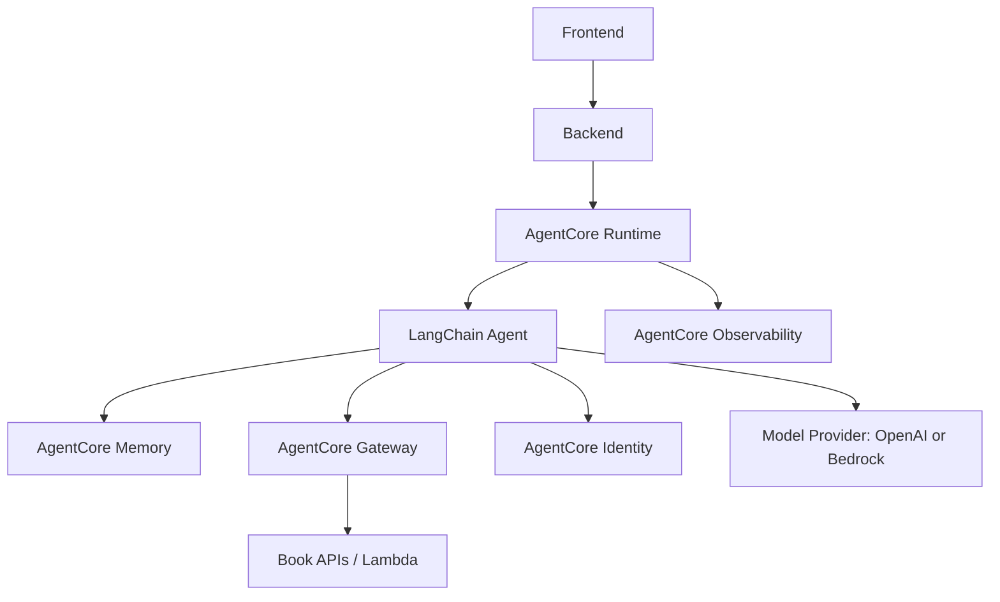

---
tags:

- aws
- bedrock
- agentcore
- ai
- agents
- langchain
- production

---

# Amazon Bedrock AgentCore: Production Infrastructure for AI Agents

**Amazon Bedrock AgentCore** is not an LLM and it is not an agent framework. It's AWS's
managed runtime and set of production services for *operating* agents that were already
built with something else — LangChain, LangGraph, CrewAI, the OpenAI Agents SDK, or plain
custom code. If [FastMCP](fastmcp-knowledge-base-server.md) is about exposing tools to an
agent, AgentCore is about running the agent itself reliably once it exists.

## AgentCore vs. LangChain/LangGraph vs. the LLM Provider

These three sit at different layers, and conflating them is the most common source of
confusion:

| Layer | Answers | Examples |
|---|---|---|
| **Orchestration** | How does the agent reason, chain steps, and call tools? | LangChain, LangGraph |
| **Inference** | What model actually generates the text? | OpenAI GPT models, Bedrock-hosted models (Claude, Llama, etc.) |
| **Production runtime** | Where does this run, how does it scale, how is it secured, observed, and given memory? | Bedrock AgentCore |

A LangChain agent calling OpenAI today doesn't need to change either of the first two
layers to gain AgentCore's operational features — AgentCore hosts the process, it doesn't
replace what's inside it. Bedrock's own model catalog is irrelevant to that: AgentCore runs
any agent, including ones that only ever call OpenAI, because Runtime just executes a
container.

!!! note "Not to be confused with Bedrock Agents"
    Bedrock also has an older, separate feature called **Bedrock Agents** — a managed
    agent-building service with its own orchestration and action groups, similar in spirit
    to LangGraph. AgentCore is different: it's infrastructure that sits *underneath* an
    agent, regardless of which framework built it. An agent doesn't have to use Bedrock
    Agents to run on AgentCore.

## The Components

AgentCore is a set of independent services, each addressing one operational concern. None
of them are mandatory — pull in only what the agent actually needs.

- **Runtime** — a serverless, framework-agnostic execution environment for the agent
  process. Each session runs in an isolated microVM, supports sessions up to 8 hours, and
  scales automatically with load. This is the only component every AgentCore deployment
  uses, since it's what actually hosts the agent.
- **Memory** — managed short-term memory (raw conversation/session events) and long-term
  memory (extracted facts, summaries, preferences that persist across sessions). Without
  this, "memory" is whatever the application wires up by hand — a database row, a vector
  store, or nothing.
- **Gateway** — turns existing APIs, Lambda functions, and OpenAPI/Smithy-defined services
  into MCP-compatible tools the agent can discover and call, without hand-writing a tool
  wrapper for each one.
- **Identity** — gives each agent its own identity and manages the credentials it uses to
  call tools and AWS resources on a user's behalf, integrating with external identity
  providers (Okta, Entra ID, Cognito) instead of embedding static API keys in the agent.
- **Browser / Code Interpreter** — sandboxed, managed environments for an agent that needs
  to browse the web or execute generated code, so that capability doesn't have to be built
  and isolated in-house.
- **Observability / Evaluations** — built-in tracing and metrics (session count, latency,
  error rate, tool-call duration) surfaced in CloudWatch, plus evaluation tooling for agent
  quality over time.

Crucially, **AgentCore does not make the model's answers better.** The reasoning quality
of the agent is still entirely a function of the model and the prompt/orchestration logic
running inside Runtime. AgentCore's value is reliability, security, and operability around
that unchanged reasoning — the same distinction as deploying an existing web app to managed
infrastructure instead of a shared VM: the application logic doesn't get smarter, it gets
easier to run correctly at scale.

## Example: A Book-Reading Assistant

Consider an app where a user is reading page 127 of a book and asks a question about what
they just read.

### Stage 1 — Simple RAG, no agent

The backend embeds the question, retrieves the relevant chunk of the current page (or
nearby pages), and asks the model to answer using that context:

```python
def answer_question(book_id: str, page: int, question: str) -> str:
    context = retrieve_context(book_id, page)
    return llm.invoke(f"Context:\n{context}\n\nQuestion: {question}")
```

This works as long as the answer lives entirely on the current page. It breaks down the
moment the question needs something outside that narrow context — "how does this connect
to chapter 3?", "what's this character's full backstory?", "save a note on this passage."

### Stage 2 — A tool-using agent

Give the model tools instead of a single fixed context block, and let it decide what it
needs:

```python
from langchain_core.tools import tool

@tool
def get_current_page(book_id: str) -> int:
    """Return the page the user is currently on."""
    ...

@tool
def get_page(book_id: str, page: int) -> str:
    """Return the text of a specific page."""
    ...

@tool
def search_book(book_id: str, query: str) -> list[dict]:
    """Semantic search across the whole book for a query."""
    ...

@tool
def get_book_metadata(book_id: str) -> dict:
    """Return title, author, chapter list, and characters."""
    ...

@tool
def save_note(book_id: str, page: int, note: str) -> None:
    """Persist a user note attached to a page."""
    ...
```

Now "how does this connect to chapter 3?" can trigger `search_book`, and "save a note
about this" can trigger `save_note` — the agent decides which tools it needs per question
instead of the backend hard-coding one retrieval path. This is standard LangChain/
LangGraph agent construction; nothing here is AgentCore-specific yet.

### Where AgentCore enters

Nothing above required AgentCore — it's plain LangChain. AgentCore becomes relevant once
this agent needs to run in production: multiple concurrent users, sessions that persist
across app opens, notes that require the agent to authenticate as the specific user it's
acting for, and visibility into why a given answer took nine seconds or failed.

## Migration Architecture

**1. Current state** — a conventional web stack, no agent infrastructure:



**2. Minimal AgentCore migration** — wrap the *existing* LangChain agent in Runtime.
Nothing about the agent's logic or model provider changes; only where it executes:



This is the low-risk first step: package the same LangChain code that already runs
locally or on a plain server as a container, deploy it behind Runtime, and get isolated
sessions, autoscaling, and a managed execution boundary — without touching orchestration
or model choice.

**3. Fuller architecture** — adopt the other components as real needs show up:



Each addition maps to a specific operational need: Memory once sessions need to persist
across app restarts, Gateway once `get_page`/`search_book`/`save_note` are better exposed
as governed APIs than in-process functions, Identity once `save_note` must act as a
specific authenticated user rather than a shared service credential, and Observability
once "why did this session fail" needs an actual answer instead of grepping application
logs.

## When AgentCore Is Overkill

For the Stage 1/Stage 2 book assistant as described — one user, one session, a handful of
read-only tools, no persistent memory requirement — plain LangChain on a normal server or
Lambda is simpler and cheaper. AgentCore adds infrastructure surface (containers, IAM,
CloudWatch dashboards, another AWS bill line) that only pays for itself once the app has
problems AgentCore specifically solves.

It starts being worth it when several of these show up together:

- Multiple tools or multiple cooperating agents, not one flat tool list.
- Sessions that need to persist and recall context across visits, not just within one
  request.
- Real authentication/authorization: the agent must act *as* a specific user against
  protected resources, not with one shared API key.
- Enough concurrent load that manual scaling/capacity planning becomes real work.
- A production need to actually observe agent behavior — latency, failure modes, tool-call
  patterns — rather than debugging via ad hoc logging.
- Secure, governed access to internal AWS resources (databases, internal APIs) that
  shouldn't be reachable with a static credential embedded in the agent process.

## A Practical Migration Strategy

Don't rewrite the agent to adopt AgentCore. The pattern that keeps risk low:

1. **Containerize the existing agent unchanged.** If it already runs as a Python process
   locally, wrapping it for Runtime is packaging work, not a rewrite.
2. **Deploy to Runtime alone first**, keeping the current model provider and orchestration
   exactly as they are. Validate that sessions, scaling, and logging behave as expected.
3. **Add Observability early** — it's the cheapest way to find out whether the migration
   actually changed anything before adding more moving parts.
4. **Adopt Memory, Gateway, or Identity individually**, each only when its specific problem
   shows up (state loss between sessions → Memory; unwieldy in-process tool functions →
   Gateway; a need for per-user authorization on tool calls → Identity).
5. **Leave the model provider alone unless there's a separate reason to move it.** Switching
   from OpenAI to a Bedrock-hosted model is an independent decision from adopting AgentCore
   — nothing about Runtime requires using Bedrock's models.

## Pricing

AgentCore is **usage-based, not a fixed monthly subscription** — there's no minimum fee,
and each component bills independently for what it actually consumes. Model/inference
cost (OpenAI's API bill, or Bedrock's per-token model pricing) is entirely separate and
additive on top of AgentCore's own charges.

As of writing, the representative rates are:

| Component | Unit | Rate |
|---|---|---|
| Runtime | per vCPU-hour (active compute only, not idle wait time) | ~$0.0895 |
| Runtime | per GB-hour (peak memory over session lifetime) | ~$0.00945 |
| Memory | short-term, per event created | usage-based, no fixed fee |
| Memory | long-term, per record stored/month (varies with extraction strategy) | usage-based |
| Gateway | per 1,000 tool invocations (`InvokeTool`, `ListTools`, `Ping`) | ~$0.005 |
| Gateway | VPC egress, per GB (only when deployed inside a VPC) | ~$0.006 |
| Browser / Code Interpreter | vCPU-hour / GB-hour, same model as Runtime | usage-based |
| Observability | CloudWatch ingestion/storage, standard CloudWatch pricing | usage-based, no built-in cap |

!!! warning "Verify before budgeting"
    AgentCore pricing has multiple components and AWS updates rates periodically. Treat
    the table above as directionally correct rather than a quote, and check the
    [official AgentCore pricing page](https://aws.amazon.com/bedrock/agentcore/pricing/)
    before committing to a cost estimate — this article's numbers were last verified in
    September 2026.

### Cost example: a low-volume book app

For a single-user app with occasional questions per reading session (say, 50 sessions/month,
each running the agent for ~2 minutes of active compute on a small container, a handful of
tool calls per session, and no long-term memory yet):

- **Runtime compute**: 50 sessions × 2 min × (small vCPU/memory footprint) is on the order
  of a few dollars a month — Runtime bills only active CPU time, not the idle time an agent
  spends waiting on the LLM or a tool response, which is often the majority of a session.
- **Gateway**: a few hundred tool invocations a month is well under $1 at $0.005/1,000
  calls.
- **Observability**: CloudWatch's standard free tier likely covers this volume; it becomes
  a real line item only at meaningfully higher log/metric volume.
- **Model inference** (OpenAI or Bedrock): almost certainly the dominant cost at this scale
  — a handful of LLM calls per session, priced per token, will typically exceed the
  AgentCore infrastructure charges above for a low-volume app.

The variables that actually move this bill as usage grows: Runtime's active compute
duration (agents that wait a lot on slow tools or long model generations accrue more
vCPU-hours), memory footprint per session, how many Gateway-routed tool calls each session
makes, Observability volume once verbose tracing is enabled, and — usually the largest
single factor — the token volume sent to the underlying model.

## Summary

- AgentCore is production infrastructure for agents, not an LLM or an agent framework —
  it runs underneath LangChain/LangGraph and any model provider, OpenAI included.
- Its components (Runtime, Memory, Gateway, Identity, Browser/Code Interpreter,
  Observability) are independent; adopt only the ones that solve a real operational
  problem.
- It does not improve model output quality — its value is reliability, scaling, security,
  and visibility around an agent whose reasoning logic is unchanged.
- Migrate incrementally: wrap the existing agent in Runtime first, then add other
  components as specific needs (persistent memory, governed tool access, per-user auth,
  real observability) appear.
- Pricing is usage-based across independently metered components, with model/inference
  cost billed separately — for a low-volume app, LLM token cost typically dominates over
  AgentCore's own infrastructure charges.

## Related Articles

- [FastMCP: Building and Deploying an MCP Server](fastmcp-knowledge-base-server.md) —
  exposing tools to an agent; AgentCore Gateway solves a related but distinct problem
  (turning existing APIs into governed MCP tools rather than hand-writing an MCP server).
- [AWS Lambda](../devops-tools/aws/lambda.md) — the serverless execution model that
  AgentCore Runtime's isolated, scale-to-zero sessions share a lot of design DNA with.
- [AWS CDK](../devops-tools/aws/cdk.md) — the pattern for defining AgentCore Runtime
  deployments and Gateway configuration as code rather than manual console setup.
- [Amazon CloudWatch](../devops-tools/aws/cloudwatch.md) — where AgentCore's built-in
  Observability metrics and traces actually surface.
