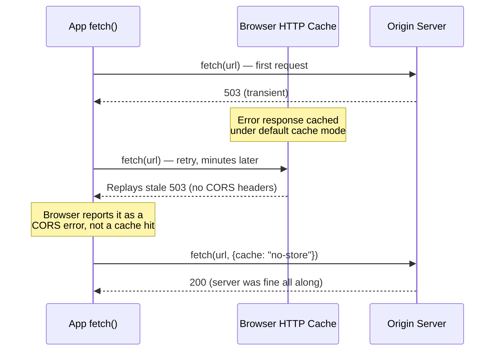
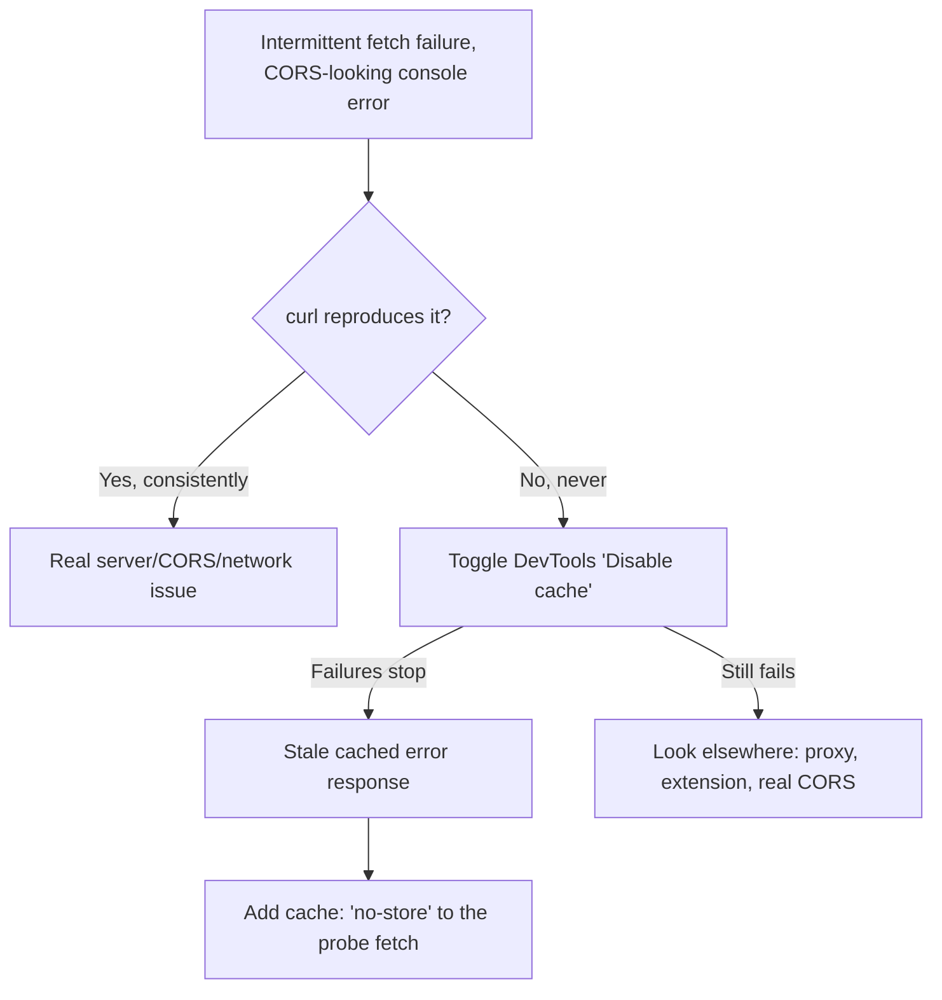

---
tags:

- troubleshooting
- javascript
- networking
- browser
- caching

---

# Intermittent "CORS Error" / "Failed to Fetch" That's Actually a Stale Browser Cache

An intermittent `TypeError: Failed to fetch` with a "blocked by CORS policy" console
message turned out to have nothing to do with CORS, the server, or the network — the
browser's HTTP cache was replaying a stale error response for every request to that exact
URL, until the entry expired.

## Environment

- Symptom: `fetch()` HEAD probe to a cross-origin S3 URL, from a read-aloud audio player
- Browsers: desktop Chrome, incognito, mobile Samsung Internet — all reproduced it
- Deployment target: static export (GitHub Pages), not a live dev/prod server

## Problem

- A `fetch()` HEAD probe to a cross-origin URL intermittently failed with
  `TypeError: Failed to fetch`, and the console showed:

    ```text
    Access to fetch at '...' has been blocked by CORS policy: No
    'Access-Control-Allow-Origin' header is present on the requested resource.
    ```

- Worked once, then failed reliably for 10-20 minutes, then worked again — reproducible
  across desktop Chrome, incognito, and mobile Samsung Internet.
- `curl` from multiple machines/networks, with matching headers, HTTP/2, concurrent
  bursts — never reproduced it, not once across 100+ requests.

The curl-vs-browser split was the first real clue: whatever was wrong lived somewhere
`curl` doesn't have — a warm browser cache.

## Root Cause

**The browser's HTTP cache stores an error response (e.g. a 503) for a `fetch()` call and
keeps replaying it** for every subsequent request to that exact URL+method under default
cache mode — for minutes, until the entry is evicted. `curl` never hits this because it
never has a warm browser cache to poison in the first place.

A "blocked by CORS policy: no Access-Control-Allow-Origin header" message is **not proof
of a CORS misconfiguration** — it's what the browser shows for *any* cross-origin failure
where the response (real or cached) lacks CORS headers, including a stale cached error.



### How it was proved (the reusable part)

1. Caught the app's probe failing live via DevTools network inspection.
1. **In the same tab, at the same moment**, ran a manual `fetch()` to the *exact same URL*
   from the console:
    - Same options as the app's fetch (default cache mode) → failed, every time.
    - Same call but with `cache: "no-store"` added → succeeded, every time.
1. Same URL, same tab, same instant — the only variable was cache mode. That's about as
   close to a controlled experiment as you get in a live browser bug.
1. Independently confirmed via Chrome DevTools' **"Disable cache"** checkbox (Network
   tab) — failures stopped completely while checked.

## Fix

Add `cache: "no-store"` to any `fetch()` that's a **status/availability probe** —
something that must always reflect current server state (HEAD checks, health checks,
"does this resource exist yet" checks, short-lived metadata):

```javascript
const res = await fetch(url, { method: "HEAD", cache: "no-store" });
```

Cache the *content* (via normal `Cache-Control` headers on the actual resource), never
cache the *probe*.

## Prevention



- **If `curl`/server-side tools can't reproduce a client-reported network failure no
  matter how hard you try, stop trying to reproduce it server-side** — the bug is
  client-side.
- Verify the server's actual live headers with `curl -I` before touching CORS config —
  don't trust a "CORS" console message at face value.
- Toggle DevTools "Disable cache" before writing any code — it's a 2-second test for "is
  this a caching problem."
- A/B test the *exact* failing request, in the *exact* failing session, changing one
  variable at a time (cache mode, headers, protocol) via the page's own console — this
  beats theorizing every time.
- Don't declare victory on "no console errors" from a single local test — verify against
  the real target environment, and re-run the *original* repro steps, not just a proxy
  check.
- Add `cache: "no-store"` by default to any fetch that's a status/availability probe, not
  just after you've already been burned by this once.

## Compounding Bugs That Made This Harder to Diagnose

Several separate, real bugs were compounding into similar-looking symptoms during the
same investigation, which made it easy to mistake a partial fix for *the* fix:

- **A genuine Next.js 14.1.x bug**: under a non-empty `basePath` + static export, the App
  Router's client-side RSC/flight-payload prefetch computed a malformed URL for the root
  route, 404ing on every page load and cascading into a full fallback page reload. Fixed
  by upgrading to 14.2.x.
- **`trailingSlash: true` changed the symptom without fixing the bug** — the malformed
  URL changed shape but was still wrong. Don't assume a config change "fixed" something
  just because the exact error string changed; re-verify against the *original* repro.
- **A missing retry path**: the component's own probe had a "probe once, ever" guard —
  if the first probe failed for any reason (including the cache issue above), it was
  stuck showing the error forever with no recovery short of a full remount. Worth fixing
  independently, but retrying alone would've just kept re-hitting the same poisoned cache
  entry.
- **A misleading local test environment**: `next dev`/`next start` (a live server) can't
  reproduce bugs specific to a real static-export deployment (no dynamic RSC endpoint, no
  image optimization endpoint). A Docker Compose + nginx replica of the real deployment
  shape catches that class of bug — though even that replica can't catch the cache bug,
  since browser HTTP caching is a client-side concern no server replica reproduces.
