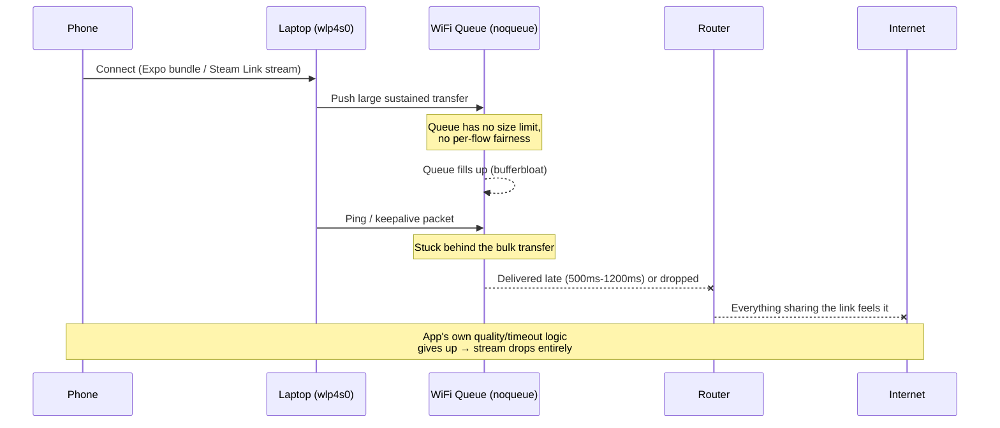
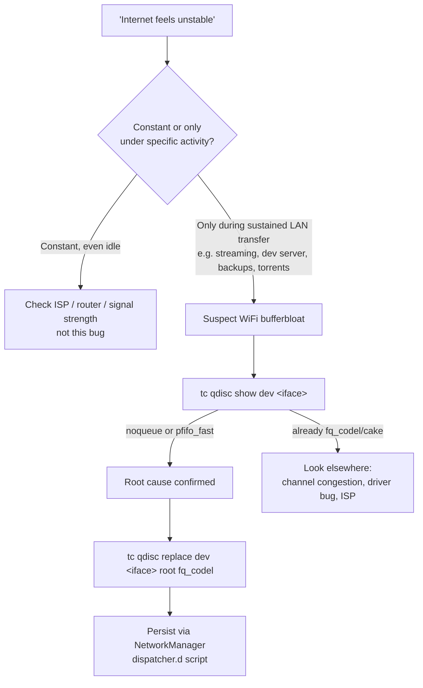

---
tags:

- troubleshooting
- networking
- linux
- wifi

---

# WiFi Connection Collapses Only When Streaming to a LAN Device (Expo, Steam Link)

Internet felt "unstable" only in specific situations — running an Expo dev server for a
phone to connect to, or streaming games to a phone via Steam Link. Regular browsing was
fine most of the time. Turned out to be classic **WiFi bufferbloat**: the wireless
interface had no active queue management, so any sustained local transfer filled an
unbounded queue and buried every other packet (including the connection itself) behind
it.

## Environment

- OS: Ubuntu (kernel `6.17.0-1032-oem`)
- WiFi chipset: MediaTek MT7925E (`mt7925e` driver, PCIe)
- Network manager: NetworkManager
- Symptom reproduced with: Expo (`expo start`, Metro bundler push to phone), Steam Link
  (game streaming to phone over LAN)
- Not specific to this chipset or these two apps — see [Root Cause](#root-cause)

## Problem

Internet "randomly" became unstable — high ping, stalls, occasional full disconnects —
but only during specific activities:

- Running `expo start` and connecting a phone to it for live-reload development
- Streaming a game to a phone with Steam Link

Once the dev server was stopped or the stream ended, the connection went back to normal
within seconds. This on/off correlation was the first real clue — a flaky router or ISP
wouldn't care whether Expo was running.

Initial ping tests to the gateway and to `8.8.8.8` looked mostly fine in isolation:

```text
$ ping -c 10 8.8.8.8
...
10 packets transmitted, 10 received, 0% packet loss
rtt min/avg/max/mdev = 43.582/57.192/72.442/7.005 ms
```

The instability only showed up under load, which is why a quick manual ping check kept
looking "fine" — the bug is load-dependent, not constant.

## Root Cause

Reproduced live by running `ping -D` against both the gateway and `8.8.8.8` in the
background while starting Expo / Steam Link, and watching `journalctl -k -f` at the same
time. Two things were checked in parallel: whether the WiFi was actually
disconnecting/reassociating at the driver level, and what the latency was doing.



Findings, in order:

1. **No deauth/reassociation during the actual bufferbloat collapse.** `journalctl -k -f`
   showed zero WiFi-level disconnect events during the worst latency spikes. This ruled
   out "flaky driver keeps dropping the radio link" as the mechanism for this specific
   symptom (a separate, unrelated `mt7925e` deauth/reassoc issue was also present in this
   environment, traced to stale firmware — but it wasn't what caused the Expo/Steam Link
   drops).
2. **Latency spiked identically on the gateway hop and on `8.8.8.8` at the same
   moments**, proving the bottleneck was the local WiFi link, not the ISP or anything past
   the router:

    ```text
    # Gateway ping, immediately after Metro finished bundling to the phone
    icmp_seq=119 time=1169 ms
    icmp_seq=121 time=575 ms
    icmp_seq=123 time=220 ms

    # 8.8.8.8 ping, same window
    icmp_seq=112 time=995 ms
    icmp_seq=123 time=731 ms
    ```

3. **The interface's queueing discipline (qdisc) was `noqueue`:**

    ```text
    $ tc qdisc show dev wlp4s0
    qdisc noqueue 0: root refcnt 2
    ```

    `noqueue` means no active queue management at all — packets queue up in the driver
    with no size cap and no fairness between flows. A large sustained transfer (Expo's
    bundle push, Steam Link's continuous video stream) fills that queue completely.
    Every other packet sharing the interface — including ICMP pings, DNS, TCP ACKs, and
    Steam Link's own control/keepalive traffic — queues up behind it and gets delayed by
    however long it takes to drain the backlog. This is the textbook definition of
    **bufferbloat**.

4. **Why it only shows up with Expo/Steam Link and not normal browsing:** ordinary web
   traffic is bursty and asymmetric — it doesn't sustain enough continuous throughput to
   fill an unbounded queue. Expo's bundle transfer and, especially, Steam Link's
   continuous video stream do sustain load, so they're what exposes the problem.

5. **Why the underlying WiFi chipset/driver matters less than it seems:** this is not a
   `mt7925e`-specific bug. WiFi interfaces on Linux default to `noqueue` because the
   `mac80211` stack does its own internal per-station/per-TID queueing for 802.11e QoS
   and frame aggregation — stacking a second dumb `tc` queue on top used to be considered
   redundant. The gap is that `mac80211`'s internal queueing does frame
   scheduling/aggregation, not latency-bounded active queue management (AQM). Wired
   Ethernet interfaces, by contrast, ship with `fq_codel`-family defaults precisely
   because they lack that internal intelligence and need it at the `tc` layer. Any Linux
   laptop on `noqueue` WiFi sharing bandwidth with a sustained-throughput LAN app can hit
   this.

## Fix

### Temporary (until reboot / next interface reconnect)

```bash
sudo tc qdisc replace dev wlp4s0 root fq_codel
```

Replace the interface's qdisc with **`fq_codel`** (Fair Queuing + Controlled Delay):

- **Fair Queuing**: splits traffic into per-flow queues, so one hungry flow (the Steam
  Link stream) can't starve everything else (ping, DNS, the stream's own keepalives)
  sharing the same interface.
- **CoDel**: actively watches queue delay and drops/marks packets once delay creeps up,
  keeping latency bounded instead of letting the queue grow unchecked.

Verify it applied:

```bash
$ tc qdisc show dev wlp4s0
qdisc fq_codel 8001: root refcnt 2 limit 10240p flows 1024 quantum 1514 target 5ms interval 100ms memory_limit 32Mb ecn drop_batch 64
```

This alone took a Steam Link session from dropping after ~10 seconds to running for
20+ minutes uninterrupted (stopped voluntarily, not by a failure).

### Persistent (survives reboot, sleep/resume, WiFi reconnects, roaming)

`tc qdisc` settings don't survive an interface going down and back up, and WiFi
interfaces cycle through that constantly (sleep/resume, roaming, reconnects). Reapply it
automatically via a NetworkManager dispatcher script, keyed on the **interface name**, not
the SSID — so it applies no matter which WiFi network you connect to.

Create `/etc/NetworkManager/dispatcher.d/99-fq_codel`:

```sh
#!/bin/sh
# Apply fq_codel to wlp4s0 to fix WiFi bufferbloat (Steam Link / Expo stalls).
IFACE="$1"
ACTION="$2"

if [ "$IFACE" = "wlp4s0" ] && { [ "$ACTION" = "up" ] || [ "$ACTION" = "connectivity-change" ]; }; then
    /sbin/tc qdisc replace dev wlp4s0 root fq_codel
fi
```

Then set correct ownership and permissions — NetworkManager silently ignores dispatcher
scripts that aren't `root:root` and executable:

```bash
sudo chown root:root /etc/NetworkManager/dispatcher.d/99-fq_codel
sudo chmod 755 /etc/NetworkManager/dispatcher.d/99-fq_codel
```

Verify it actually fires by cycling the radio and checking the qdisc again (should show
`fq_codel` again without running the `tc` command manually):

```bash
nmcli radio wifi off && sleep 3 && nmcli radio wifi on && sleep 6
tc qdisc show dev wlp4s0
```

Swap `wlp4s0` for your own interface name (`ip -br addr` to find it) if different.

## Prevention / How to Recognize This Class of Bug Again



- **Recognize the pattern**: instability that correlates with a specific sustained-load
  activity (game streaming, dev server pushing builds to a device, large uploads/backups,
  torrenting) rather than being constant, is a strong signal for bufferbloat rather than a
  hardware/ISP fault.
- **Quick diagnostic**: `tc qdisc show dev <interface>` — if it says `noqueue` or
  `pfifo_fast` and you're seeing load-correlated instability, this is very likely it.
- **Confirm before fixing**: reproduce with a background `ping -D <gateway>` and
  `ping -D 8.8.8.8` running while the load-generating app runs. If both spike together at
  the same moments, the bottleneck is local (your queue), not the ISP — this also rules
  out wasting time on router/ISP troubleshooting.
- **This fix is scoped to the interface, not the network** — it applies regardless of
  which WiFi SSID you connect to, since the dispatcher script matches on `wlp4s0`, not a
  connection profile.
- **What this fix does *not* solve**: physical-layer capacity. If the WiFi channel itself
  is congested (many overlapping neighboring networks) or the link rate is low, fq_codel
  manages the resulting congestion gracefully instead of collapsing, but it can't create
  bandwidth that isn't there. Persistent jitter even with fq_codel active is a sign to
  also check channel congestion (`nmcli -f SSID,SIGNAL,CHAN dev wifi list`) and consider
  moving the AP to a less congested channel.
